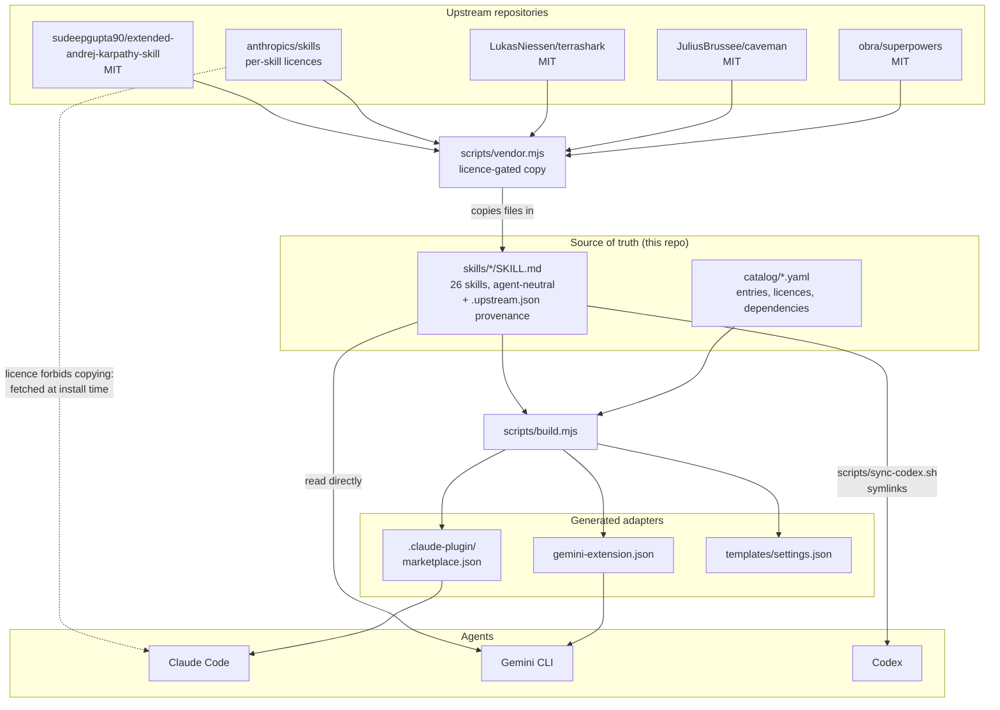
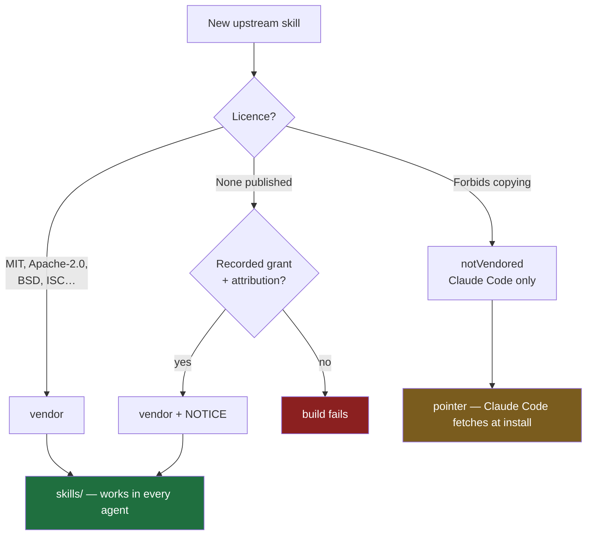
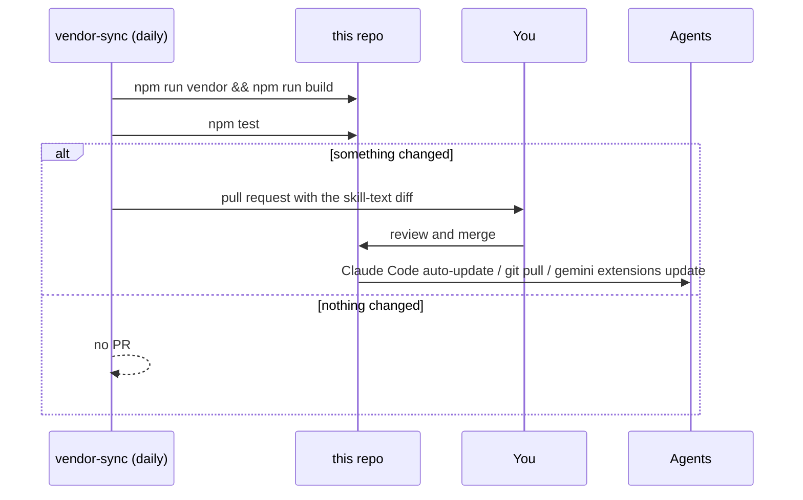
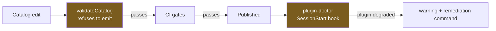

# Architecture

How the pieces fit, end to end.

## The shape



The dotted line is the exception worth noticing: `anthropics/skills` appears twice because it's licensed
per skill — `mcp-builder` is copied in, while the document skills can only ever be fetched by Claude Code.

## The decision that shapes every entry



Detail in [002 — Licence tiers](002-licence-tiers.md).

## What runs when

| Command | Does | Gate? |
| --- | --- | --- |
| `npm run vendor` | Re-fetches upstream skills into `skills/`, writes provenance | — |
| `npm run build` | Regenerates all manifests and the README table | — |
| `npm test` | Catalog rules, emission, and the real catalog's recorded decisions | ✅ CI |
| `npm run check` | Fails if generated files drift from the catalog | ✅ CI |
| `npm run vendor:check` | Fails if vendored skills drift from upstream | ✅ CI |
| `claude plugin validate ./ --strict` | Manifest and SKILL.md frontmatter legality | ✅ CI |
| `npm run sync:codex` | Symlinks `skills/*` into `~/.agents/skills/`, reports what it cannot carry | — |

`npm run vendor` is the only step that touches the network.

## Update flow



The pull request is the review gate: vendored skills reach every agent as soon as they land, so this is
the only point at which a bad upstream release can be stopped. See
[005 — Updates and automation](005-updates-and-automation.md).

## Layers of a failure



Build-time prevention catches what's knowable from the catalog; the runtime doctor catches what's only
knowable on the user's machine. Detail in [006 — Making failures loud](006-making-failures-loud.md).

## Where things live

```
catalog/marketplace.yaml      identity, cross-marketplace allowlist, renames
catalog/plugins/*.yaml        one file per entry — the complete audit surface
skills/<name>/SKILL.md        portable content; .upstream.json if vendored
scripts/lib/catalog.mjs       pure: load, validate, emit. Fully unit-tested
scripts/vendor.mjs            the licence-gated fetcher
scripts/build.mjs             thin CLI wrapper over the library
scripts/doctor.mjs            runtime check, zero dependencies
scripts/sync-codex.sh         symlink skills into ~/.agents/skills/
tests/                        fixtures in tmpdir + assertions on the real catalog
design/                       these documents
docs/                         how-to guides and upstream triage
```

Generated, never hand-edited: `.claude-plugin/marketplace.json`, `gemini-extension.json`,
`templates/settings.json`, the README catalog table, and every `skills/` directory containing
`.upstream.json`.

## Numbers

A snapshot, not a guarantee — these drift as the catalog grows. The one enforced by a test is the ratio:
Claude-only entries may never outnumber portable skills. Regenerate the rest with `npm run build`, which
prints the entry and skill counts.

| | |
| --- | --- |
| Portable skills (every agent) | 26 |
| Claude-only entries | 11 — 9 official plugins, 2 licence-blocked |
| Catalog entries | 14 (9 units, 5 bundles) |
| Marketplace entries using `source: "./"` | 12 of 14 |
| Tests | 71 |
